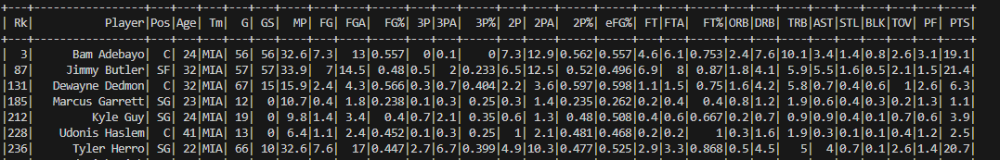
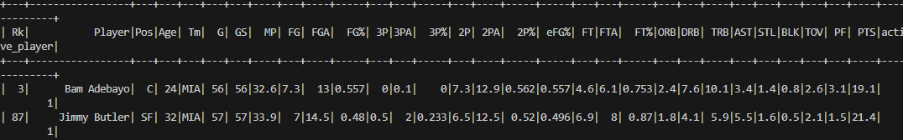

# 706 Mini-Lab 10: Utilizing PySpark for Data Processing

This purpose of this repostiory is to setup boilerplate code that for any Data Processing with PySpark. It takes in a local csv file, create a SparkSession, and then populates the Session with the contents of the csv file. From there, there are different functions written to execute any SQL Query. The dataset being used are the Regular Season Player Stats from the 2021-2022 NBA Regular Season. There is a written function that sets-up the groundwork for data transformation utilizing in-built PySpark functions. The entire system is wrapped around the Fire library. This library was utilized to wrap the entire project into a Command Line Tool.

### Tasks Performed

* Create SparkSession
* Create SQL Database
* Write code to execute SQL Query
* Wrap main.py execution with Fire library to convert code into CLI
* Write up different Spark Tests
* Test connection

### Query Proof

The following below is both an output of just the NBA players that were from the Miami Heat, as well as the end-result of the data transformation, showing which players were considered "Active Players"

